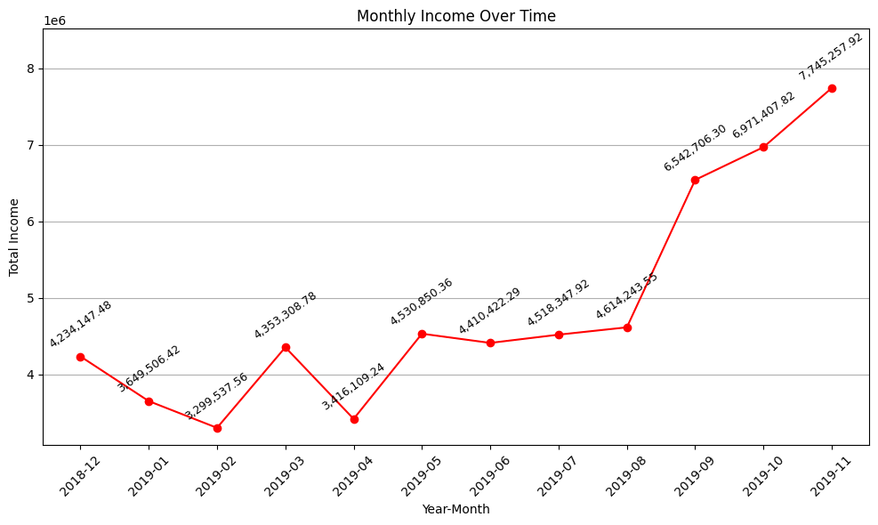
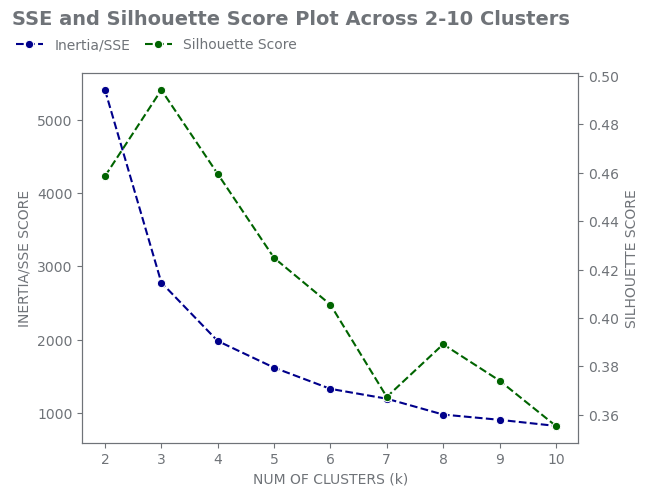
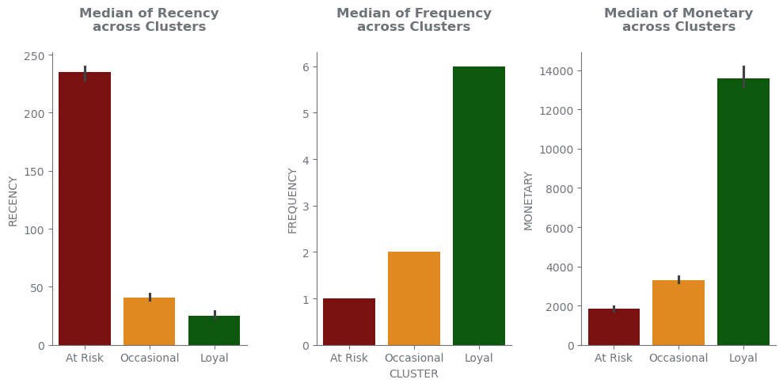

# Abstract {#abstract .unnumbered}

In today's competitive e-commerce landscape, data-driven decision-making
is essential for business growth and customer satisfaction. This project
applies advanced data mining techniques to analyze transactional data
from a London-based online retailer, aiming to extract actionable
insights into customer behavior, product associations, and sales trends.
Exploratory Data Analysis (EDA) and data cleaning were performed to
handle inconsistencies and outliers, followed by feature engineering
including RFM (Recency, Frequency, Monetary) metrics and dimensionality
reduction using Principal Component Analysis (PCA). K-means clustering
identified distinct customer segments, with cluster evaluation guided by
silhouette scores and sum of squared errors. Market Basket Analysis,
through the Apriori algorithm, revealed strong product associations both
within the UK and in international markets by excluding UK data. The
findings highlight key customer segments and product combinations,
offering valuable directions for personalized marketing, inventory
management, and market expansion strategies. This study demonstrates the
power of data mining to optimize e-commerce operations and enhance
targeted business strategies.

# Acronyms/Abbreviations {#acronymsabbreviations .unnumbered}

EDA:Exploratory Data Analysis\
RFM:Recency, Frequency and Monetory\
PCA:Principal Componet Analysic\
IQR:Interquartile Range\
SSE:Sum of Squared Errors\

# Introduction

## Background

In today's digital era, e-commerce has become an essential part of daily
life, offering customers a wide range of products and services from
around the world with just a few clicks. For businesses, it provides an
opportunity to reach a larger audience with minimal cost through
efficient digital channels. As the market becomes increasingly
competitive and fast-changing, it is crucial for businesses to make
data-driven decisions. This project focuses on applying data mining
techniques to extract valuable insights that can support strategic
decision-making in the e-commerce domain.

## Objectives

Providing actionable insights to support the future growth of the
business by:

-   Identifying trends in purchase behavior and customer preferences,
    helping to understand how buying patterns evolve over time.

-   Analyzing the most profitable products and high-value customer
    segments, enabling more targeted and effective personalized
    marketing strategies.

-   Analyzing the most profitable products and high-value customer
    segments, enabling more targeted and effective personalized
    marketing strategies.

## Research Questions

1.  What products generate the highest revenue?

2.  Which transactions were most profitable?

3.  What is the distribution of customers according to country?

4.  Which countries generate the highest revenue?

5.  What do the sales look like through the months?

6.  How many items are bought together on average?

7.  Which country is the most ideal for expansion?

8.  Who are the most valuable customers?

9.  Which customers are at risk of churning?

10. What are the strongest product associations?

11. What are the strongest product associations outside the UK?

12. How is price affecting the sales of top 10 products?

# Dataset Introduction

Dataset consists of sales transaction data of UK-based e-commerce for
one year (2018-2019). This London-based shop has been selling gifts and
homewares for adults and children through the website since 2007.

The Dataset consists of 500K rows and 8 columns. The following is the
description of each column.

1.  TransactionNo (categorical): a five or six-digit unique character
    used to identify a specific transaction.

2.  Date (numeric): the date when each transaction was generated.

3.  Product (categorical): product/item name.

4.  ProductNo (categorical): a five or six-digit unique character used
    to identify a specific product.

5.  Price (numeric): the price of each product per unit in pound
    sterling.

6.  Quantity (numeric)

7.  CustomerNo (categorical): a five-digit unique number that defines
    each customer.

8.  Country (categorical): name of the country where the customer
    resides.

# Data Preprocessing

## Data Cleaning

During the data cleaning phase, several issues were identified and
addressed to ensure data quality and reliability for analysis.

The `Quantity` column contained negative values, which are not valid in
the context of purchase data. These values were corrected by applying an
absolute value transformation, assuming that the negative entries were
the result of data entry or system errors.

The `ProductNo` and `TransactionNo` fields exhibited noise in the form
of random alphabetical characters such as 'A', 'B', and 'C' appended to
numeric values. These irregularities were cleaned by extracting and
retaining only the numeric components, ensuring consistency and accuracy
for further analysis.

Additionally, the `CustomerNo` column had numerous missing values, which
could compromise customer-level analysis. To preserve these records,
missing values were imputed with synthetic customer IDs---unique numbers
slightly outside the normal range of existing customer IDs. This
approach maintained the integrity of the dataset while clearly
distinguishing imputed entries from genuine customer data.

## Feature Engineering

To enable more detailed analysis and meaningful visualizations, new
features were derived from the existing dataset.A new column,
`TotalMoney`, was created by multiplying `Price` and `Quantity`,
representing the total value of each product within a transaction.The
`Date` column was decomposed into separate `Year` and `Month` fields.
This allowed for drill-down analysis and supported the use of concept
hierarchies when analyzing sales trends at different granularities in
time. In addition, ` monthly revenue` was calculated by aggregating
transaction totals by month, providing a clearer view of sales
performance and seasonality over time.

# Exploratory Data Analysis

To gain an initial understanding of the dataset, Exploratory Data
Analysis (EDA) was performed. This step involves summarizing the main
characteristics of the data through statistical measures and
visualizations. The goal is to identify patterns, detect anomalies,
understand data distributions, and uncover relationships between
variables that can guide further analysis. The EDA focuses on key
aspects such as customer behavior, product performance, and sales
trends, which are essential for deriving actionable insights in the
context of e-commerce.

## Univariate Analysis

We start the analysis by exploring key numerical features, including
Price and Quantity, to review their summary statistics and assess their
distribution, variability, and potential anomalies.

::: {#tab:summary_statistics}
  **Statistic**     **Price**   **Quantity**
  --------------- ----------- --------------
  Count               536,350        536,350
  Mean                  12.66          10.93
  Std Dev                8.49         216.61
  Min                    5.13           1.00
  25%                   10.99           1.00
  50% (Median)          11.94           3.00
  75%                   14.09          10.00
  Max                  660.62      80,995.00

  : Summary statistics for `Price` and `Quantity` columns
:::

From the summary statistics, it is evident that the dataset primarily
consists of low-priced products, and customers typically purchase around
10 units of the same product per transaction on average. However, the
presence of extreme values in both the Price and Quantity columns
suggests the existence of outliers.

Before proceeding with visualizations, we will apply Z-score-based
outlier removal to clean these columns. This will ensure that the
resulting box plots provide a more accurate and meaningful
representation of the underlying distribution.

{width="15cm"}

{width="15cm"}

### How many items are bought together on average?

{width="15cm"}

This highlights that while there are occasional sales involving large
quantities, the majority of transactions involve low-cost products
purchased in relatively small quantities.

## Bivariate Analysis

### What is the distribution of customers according to country?

To gain insights into regional sales performance, we first analyze the
customer distribution by country, which helps identify where most sales
are occurring and highlights potential markets for future growth.

{width="15cm"}

The visualization reveals that the majority of our customers are from
the United Kingdom, which is expected given that the data originates
from a London-based store.

### Which country is the most ideal for expansion?

The next largest customer base appears to be from various European
countries, indicating a strong regional presence. Since the UK is
already our primary market, it is excluded from our expansion analysis.
To further explore potential markets for growth, we will now examine a
geographic heatmap to identify countries where entry and expansion may
be most feasible based on existing customer patterns.

{width="15cm"}

Among the European countries, France and Germany stand out with the
highest number of customers, indicating a strong presence and potential
for deeper market penetration in these regions. Interestingly, a South
American country, Cayerina, also shows a relatively high customer count.
This unexpected trend suggests an opportunity to explore untapped
international demand outside the primary market region. These insights
can guide strategic decisions around regional marketing, localization,
and logistics planning for future expansion.

Now, let's turn our attention to the Product and Transaction columns as
well. Initially, we observe that the dataset contains 3,768 unique
products, and over the past year, there have been 23,205 unique
transactions recorded.

### Which countries generate the highest revenue?

{width="15cm"}

The pie chart shows that while the United Kingdom leads in revenue as
expected, the Netherlands and EIRE generate more revenue than Germany
and France despite having fewer customers. This suggests that these
countries may have a more loyal or higher-value customer base, which
could be valuable for targeted marketing and growth strategies.

### Which transactions were most profitable?

{width="15cm"}

The top two transactions stand out with significantly higher values
compared to the rest, suggesting that they may be outliers and could
potentially skew the analysis.

::: {#tab:top_quantity_transactions}
  **TransactionNo**   **ProductNo**   **ProductName**                    **Quantity**
  ------------------- --------------- -------------------------------- --------------
  581483              23843           Paper Craft Little Birdie                 80995
  541431              23166           Medium Ceramic Top Storage Jar            74215

  : Top two transactions by quantity
:::

As expected, these top transactions involve the purchase of large
quantities of the same product, which explains their unusually high
total values. Next, we will examine the most common items appearing in
the top 10 transactions to identify which products contribute most
significantly to high-value sales.

{width="15cm"}

   **ProductNo**  **ProductName**
  --------------- -------------------------------------
       23203      Jumbo Bag Vintage Doily
       23201      Jumbo Bag Alphabet
       23207      Lunch Bag Alphabet Design
       23192      Bundle Of 3 Alphabet Exercise Books
       22492      Mini Paint Set Vintage
       22551      Plasters In Tin Spaceboy
       21915      Red Harmonica In Box
       21731      Red Toadstool Led Night Light
       20971      Pink Blue Felt Craft Trinket Box
       22158      3 Hearts Hanging Decoration Rustic

  : Product List - Frequently bought products in top transactions

### What products generate the highest revenue?

{width="13cm"}

   **ProductNo**  **ProductName**
  --------------- ------------------------------------
       22197      Popcorn Holder
       84077      World War 2 Gliders Asstd Designs
       23843      Paper Craft Little Birdie
       85123      Cream Hanging Heart T-Light Holder
       84879      Assorted Colour Bird Ornament
       21212      Pack Of 72 Retrospot Cake Cases
       23084      Rabbit Night Light
       85099      Jumbo Bag Red Retrospot
       22423      Regency Cakestand 3 Tier
       22492      Mini Paint Set Vintage

  : Product List - Top 10 Products by revenue

### How is price affecting the sales of top 10 products?

Next, let us analyze how pricing influences the sales performance of the
top 10 products, to determine whether higher or lower prices have a
noticeable impact on their demand.

{width="15cm"}

For most products, sales tend to decline when prices are increased,
indicating price sensitivity among customers. However, two
top-performing items---\"Popcorn Holder\" and \"Assorted Colour Bird
Ornament\" continue to perform well even at higher price points. This
suggests that these products may have a strong perceived value or loyal
customer demand, making them less sensitive to price changes.

### What do the sales look like through the months?

{width="15cm"}

The sales data indicates a steady month-over-month increase in revenue
throughout the past year, reflecting consistent growth in overall
business performance.

# Market Basket Analysis

Market Basket Analysis (MBA) is a data mining technique used to uncover
patterns in customer purchasing behavior by identifying products that
are frequently bought together. This technique is particularly valuable
in the context of e-commerce and retail, as it helps businesses make
informed decisions about product placement, cross-selling strategies,
and personalized recommendations. In this section, we apply association
rule mining to discover frequent itemsets and generate rules that
highlight co-purchase relationships among products. The goal is to gain
insights into how different items are related within transactions and
use these findings to improve business strategy.

### What are the strongest product associations?

To identify the strongest relationships between products, we apply the
Apriori algorithm, a widely used method for mining frequent itemsets and
generating association rules. This helps uncover which products are most
commonly purchased together. We begin by visualizing the support vs.
confidence values for the generated rules. This scatter plot provides an
overview of the strength and frequency of associations in the dataset.

{width="10cm"}

Next, we filter the rules to show only those with confidence above 0.7,
helping us focus on the strongest and most reliable rules.

 all countries.png){width="15cm"}

Finally, we present a heatmap that visualizes the actual
product-to-product associations using their names, offering a clearer
and more intuitive understanding of the most significant co-purchase
patterns.

{width="15cm"}

Here, we find many strong association rules that could be used for
personalized marketing like selling strongly associated times in a
bundle deal. We could also use this for product recommendation when a
user buys one of the associated products.

### What are the strongest product associations outside the UK?

Because the dataset is heavily dominated by UK transactions, we repeated
the association analysis excluding all UK-based data to better
understand purchasing patterns in other regions. This approach allows us
to identify product associations that are more representative of
international customer behavior.

Similar to the previous analysis, we applied the Apriori algorithm on
the filtered dataset and generated association rules. A support vs.
confidence scatter plot visualizes the distribution of these rules
outside the UK.

{width="15cm"}

We then filtered the rules to display only those with confidence above
0.8, highlighting the strongest associations relevant to international
markets.

 other countries.png){width="15cm"}

Finally, a heatmap presents the most significant product-to-product
associations by name, providing clear insights into popular product
combinations outside the UK.

{width="15cm"}

As expected the association rules came out to be very different when we
excluded UK. Here, we find many strong association rules that are for
countries other than the UK this show trend and purchase behavior
variation. This could be used for specialized market campaigning and
market expansion along with before mentioned bundles and recommendation.

# RFM Cluster Segmentation

To identify distinct segments within the current customer base, we
conducted Exploratory Data Analysis (EDA) followed by the application of
the **K-means clustering algorithm**. The best customer segments were
then evaluated and selected using the **RFM (Recency, Frequency,
Monetary)** framework.

## RFM Preprocessing

The RFM metrics were calculated as:

-   R: Days since last purchase (conducted a day after the latest record
    transaction date).

-   F: Total No. of unique transactions made.

-   M: Aggregate customer's totalmoney spend

## RFM Data Exploration

### Boxplots and Histograms

To analyze the variables, we examined outliers, skewness, and central
tendencies for each RFM component.

**Outcomes:**

-   Outliers: Both the **Frequency** and **Monetary** columns exhibited
    extreme outliers.

-   Data Dispersion: For all RFM variables, the **standard deviation
    (SD) exceeded the mean**, indicating a wide spread of data points.

-   Right Skewness: All RFM variables showed **right-skewed
    distributions**, as their means were higher than their medians.

### Outlier Handling

To ensure accurate clustering results, it is essential to address the
presence of extreme outliers. We applied the **Interquartile Range
(IQR)** method to detect and handle remaining outliers, thereby
improving the quality and reliability of the cluster representations.

After applying the IQR method for outlier removal, approximately
**15.92** of the data was excluded. This process resulted in a
**cleaner** and more **accurate** representation of the central
tendencies within the dataset.

{width="15cm"}

## RFM: Data Transformation

### Scaling

The RFM analysis employed **StandardScaler** to normalize the Recency,
Frequency, and Monetary (RFM) metrics, ensuring each variable
contributed equally to clustering. Since Monetary values had a wider
range compared to others, unscaled data would skew results. Hence,
Standardization transformed all features, preserving relative distance
while eliminating scale bias.

### Dimensionality Reduction

To enhance the performance of the K-means clustering, **Principal
Component Analysis (PCA)** was applied to reduce redundancy and focus on
the most informative features. This approach helps minimize the effects
of **multicollinearity**, which is common among RFM variables.

Although the dataset contains only three variables, the first two
principal components were sufficient to capture the majority of the
explained variance, enabling effective clustering with reduced
dimensionality.

## RFM: Clustering with K-means

To initiate the clustering process, it is crucial to determine the
optimal number of clusters, denoted by K. We evaluated values of K
ranging from 2 to 10 using two metrics: the **Sum of Squared Errors
(SSE)** and the **silhouette coefficient.**

{width="15cm"}

From the resulting plots, K=3 was identified as the optimal number of
clusters, corresponding to the highest silhouette score and a clear
elbow point in the SSE curve.

## Cluster Analysis

The clustering results using PCA show an acceptable separation between
clusters, with only minor imbalances. Overall, the shape and
distribution of the clusters indicate that the clustering process
produced meaningful and satisfactory groupings.

{width="15cm"}

Statistical summaries of the RFM variables were calculated for each
identified cluster. The median was chosen over the mean as the preferred
measure of central tendency due to the presence of skewness and outliers
in the data. Additionally, the cluster labels obtained from the
PCA-based clustering were assigned back to the original RFM dataset for
further analysis.

Based on summary statistics of identified clusters, we label each
cluster as:

-   Cluster 0: Loyal Customers (Lowest R, Highest F and M)

-   Cluster 1: At-Risk Customers (Highest R, Lowest F and M)

-   Cluster 2: Occasional Customers (Moderate R, F, and M)

The distribution and central tendency of each cluster were visualized to
highlight the distinctive characteristics of customer segments. This
analysis helps identify the relative importance of each segment based on
their RFM values.

{width="13cm"}

{width="13cm"}

### Who are the Most Valuable Customers?

The Loyal cluster represents the most valuable customers. Reasons:

-   Low Recency: They have purchased very recently, indicating strong
    ongoing engagement

-   High Frequency: They buy frequently, showing consistent purchasing
    behavior

-   High Monetary Value: They spend significantly more than other
    clusters, contributing disproportionately to revenue

Solutions:

-   Prioritize retention strategies with exclusive offers

-   Upsell/cross-sell premium products to maximize their lifetime value

-   Implement loyalty programs to maintain engagement

### Who are the Most Valuable Customers?

The At-Risk cluster shows clear signs of potential churn. Reasons:

-   High Recency: Their last purchase was far in the past, indicating
    disengagement.

-   Low Frequency: Most are one-time buyer with no repeat purchases.

-   Low Monetary Value: Their spending is minimal, suggesting low
    profitability.

Solutions:

-   Launch win-back campaigns with personalized discounts.

-   Investigate reasons for churn and address gaps.

### Customer Performance Overview

**1. Recency**

  **Cluster**      Median                            Interpretation
  ---------------- --------------------------------- ----------------------------------------
  **Loyal**        $\sim$`<!-- -->`{=html}25 days    Very recent activity - highly engaged
  **Occasional**   $\sim$`<!-- -->`{=html}43 days    Moderate recency - needs re-engagement
  **At-Risk**      $\sim$`<!-- -->`{=html}239 days   Danger zone - likely churning

**2. Frequency**

  **Cluster**      Median   Interpretation
  ---------------- -------- --------------------------------
  **Loyal**        6        Frequent-buyers - strong habit
  **Occasional**   2        Scattered purchasers
  **At-Risk**      1        One-time buyers

**3. Monetary**

  **Cluster**      Median                          Interpretation
  ---------------- ------------------------------- ------------------------
  **Loyal**        $\sim$`<!-- -->`{=html}13,700   High-value customers
  **Occasional**   $\sim$`<!-- -->`{=html}3,500    Moderate spenders
  **At-Risk**      $\sim$`<!-- -->`{=html}1,800    Low-value transactions

Based on the cluster's characteristics above, the **Loyal Customers
Cluster** is our potential cluster to target.

{width="13cm"}

In summary, our customer base is mainly composed of Occasional
customers, followed by At-Risk Customers, with the smallest portion
being Loyal Customers. This insight raises concerns as the number of
customers genuinely engaged with e-commerce and its products is lower
than those who make occasional purchases or at-risk customers.

## Loyal Customer Analysis

Even though small in number, they're still our most potential customer
segment. Let's inspect its characteristics as:

{width="10cm"}

{width="10cm"}

We can see that as the holiday season approaches our loyal customers buy
more from us so it might be a good idea to restock their most bought
items.

# Key Insights

## Customer Segmentation (RFM Analysis) {#customer-segmentation-rfm-analysis .unnumbered}

-   **Loyal Customers (Cluster 0)**: Low recency (25 days), high
    frequency (6), high monetary (£13,700).\
    *Recommendation:* Use loyalty programs, exclusive offers, and
    personalization.

-   **At-Risk Customers (Cluster 1)**: High recency (239 days), low
    frequency (1), low monetary (£1,800).\
    *Recommendation:* Win-back campaigns with discounts and surveys.

-   **Occasional Customers (Cluster 2)**: Moderate recency (43 days),
    frequency (2), monetary (£3,500).\
    *Recommendation:* Use upselling, cross-selling, and limited-time
    offers.

## Market Basket Analysis {#market-basket-analysis-1 .unnumbered}

-   **UK**: Products like Jumbo Bag Doily and Alphabet often bought
    together.\
    *Recommendation:* Bundle deals and optimized placement.

-   **International**: Different combos (e.g., Popcorn Holder + Bird
    Ornament).\
    *Recommendation:* Tailor marketing to regional preferences.

## Sales Trends & Product Performance {#sales-trends-product-performance .unnumbered}

-   **Top Products**: Popcorn Holder, WW2 Gliders, Little Birdie lead
    revenue.

-   **Price Sensitivity**: Most products decline with price increases,
    except a few resilient ones.\
    *Recommendation:* Adjust pricing per product elasticity.

-   **Seasonality**: Sales peak in Nov-Dec.\
    *Recommendation:* Stock early and run seasonal campaigns.

## Geographical Insights {#geographical-insights .unnumbered}

-   **UK**: Contributes 82% of revenue.\
    *Recommendation:* Focus on retention and upselling.

-   **Netherlands & EIRE**: Fewer transactions, higher per-customer
    spend.\
    *Recommendation:* Expand marketing in these regions.

## Transaction Analysis {#transaction-analysis .unnumbered}

-   **Bulk Purchases**: Some transactions involve 80,000+ units.\
    *Recommendation:* Identify B2B customers and offer bulk discounts,
    account support.

# Conclusion

This project used data mining techniques---RFM segmentation, Market
Basket Analysis, and EDA---to extract actionable insights from an
e-commerce dataset.

Key Findings:

-   **Customer Segmentation**: Identified loyal, at-risk, and occasional
    customers for targeted marketing.

-   **Product Associations**: Found co-purchase patterns for bundling
    and recommendations.

-   **Sales Trends**: Revealed seasonal demand and price sensitivity to
    guide pricing and inventory.

-   **Geographical Insights**: Highlighted growth potential in select
    international markets.

Business Impact:

-   **Personalized Marketing**: Segment-based promotions to boost
    engagement.

-   **Inventory Management**: Prioritize high-demand and price-resilient
    products.

-   **Expansion Strategy**: Target high-revenue international regions.

# References

[E-commerce Business Transaction: Sales transaction of a UK-based
e-commerce (online retail) for one
year](www.kaggle.com/datasets/gabrielramos87/an-online-shop-business/data)
